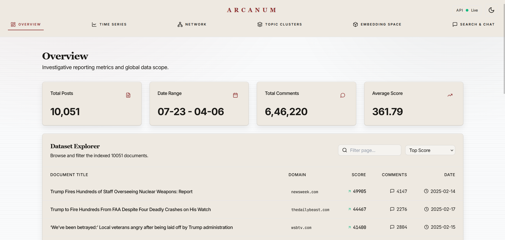
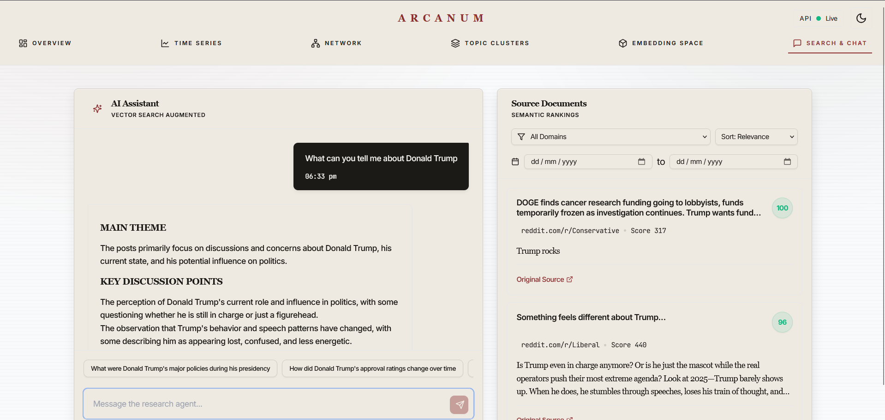
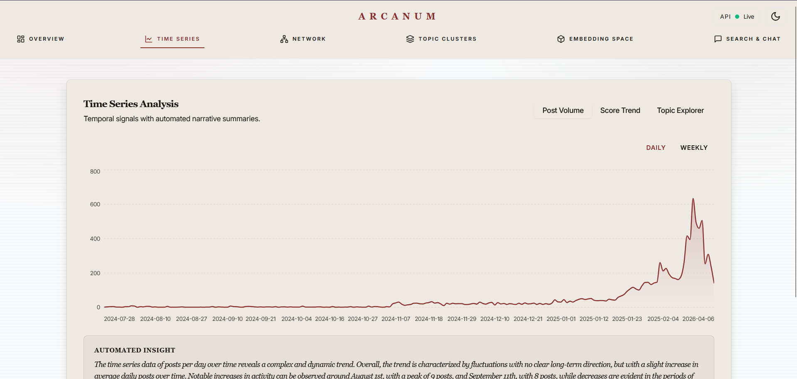
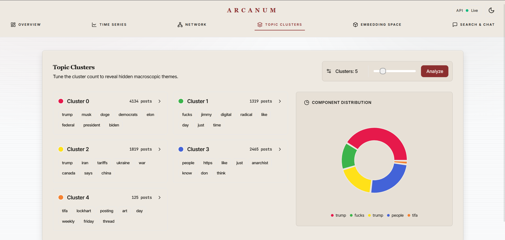
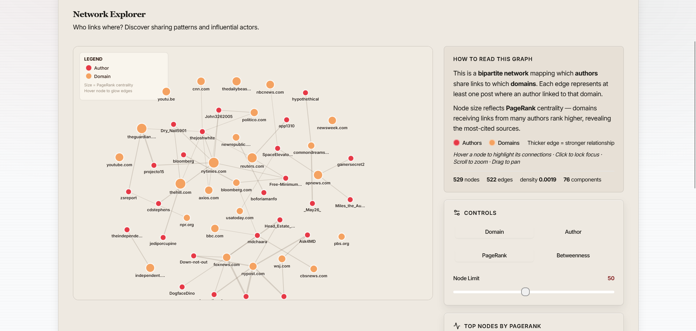
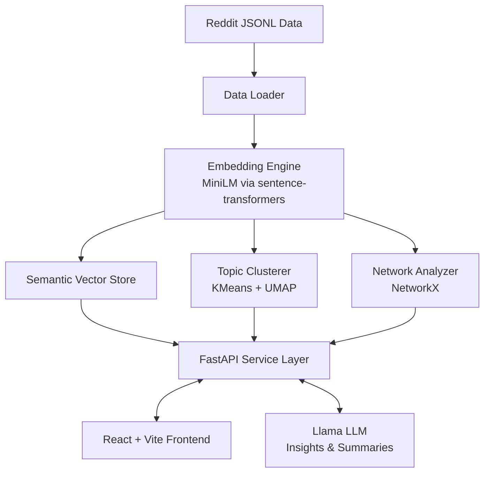

# Arcanum — Investigative Research Dashboard

<p align="center">
  
</p>

<p align="center">
  <em>An interactive intelligence platform mapping narrative spread, semantic clusters, and community influence across political discourse networks.</em>
</p>

<p align="center">
  <a href="https://github.com/Karm-Dave/research-engineering-intern-assignment">
    
  </a>
  <a href="https://arcanumdata.vercel.app/">
    
  </a>
  
  
</p>

---

## What is Arcanum?

Arcanum is a full-stack investigative research dashboard built to decode how narratives form, spread, and evolve across political communities online. It combines **semantic search**, **narrative time-series tracking**, **topic clustering**, and **network influence mapping** into a single cohesive intelligence interface — powered by ML embeddings, graph algorithms, and generative AI.

---

## Features

### 1. Semantic Search & Discovery

A dense vector embedding search engine — no exact keyword matching required. Query by concept, not by keyword.



**Zero Keyword Overlap Examples:**

| Query | Retrieved Topic | Why It Works |
|---|---|---|
| *"people helping each other without institutions"* | Mutual Aid discussions | Captures the conceptual definition, not the label |
| *"California attorney general record"* | Kamala Harris's prosecutor past | Maps public figure to geographic role descriptor |
| *"capital punishment policy"* | Death penalty debates | Structurally semantic equivalent |

---

### 2. Narrative Time-Series Analysis

Track how topics rise and fall over time. Each chart includes a **GenAI Summary** — plain-language insight dynamically generated via a Llama LLM — so non-technical audiences can immediately grasp trend significance.



---

### 3. Topic Clustering Space

Cluster political discourse into visual semantic spaces using high-dimensional UMAP projection and K-Means clustering. All parameters are fully tunable via the UI.



---

### 4. Network & Influence Mapping

Visualise community interaction as a force-directed graph. Arcanum computes **PageRank** and **Betweenness Centrality** to surface narrative linchpins — the accounts and topics that act as bridges or amplifiers across communities.



---

## Architecture



---

## AI / ML Stack

| Component | Technology | Detail |
|---|---|---|
| **Embeddings** | `all-MiniLM-L6-v2` via `sentence-transformers` | 384 dimensions, cosine similarity |
| **Dimensionality Reduction** | `UMAP` (umap-learn) | 5D for clustering preprocessing, 2D for frontend visualisation |
| **Clustering Engine** | `KMeans` (scikit-learn) | Bounded *k* spanning 2–50 clusters |
| **Network Centrality** | `PageRank` (α = 0.85) via `NetworkX` | Isolates super-spreaders across communities |
| **Generative AI** | `Llama` via Groq | Conversational analytics & time-series plain-language summaries |

---

## Robustness & Edge Cases

- **Invalid Queries** — Zero-state returns helpful messages for empty or sub-3-character queries.
- **Graceful Nullity** — Empty datasets render safe fallback components; clustering defaults safely to *k = 2*.
- **Network Resiliency** — Disconnected subgraphs do not break traversal or PageRank computations.
- **API Limits** — Explicit UI messages surface when Groq rate limits or timeout bounds are hit.
- **Internationalization** — Non-English text processes natively through the embedding vector space.

---

## Local Setup

**Prerequisites:** Python 3.10+, Node 18+

```bash
# 1. Clone the repository
git clone https://github.com/Karm-Dave/research-engineering-intern-assignment.git
cd research-engineering-intern-assignment

# 2. Install backend dependencies
python -m pip install -r backend/requirements.txt

# 3. Build the frontend
cd frontend && npm install && npm run build && cd ..

# 4. Launch the server
cd backend && uvicorn main:app --host 0.0.0.0 --port 8000
```

Dashboard live at **`http://localhost:8000`**

> **Windows users:** Use the provided `start.sh` via Git Bash or run the `start.ps1` helper script.

---

## Demo & Links

| | |
|---|---|
| **Walkthrough Video** | [Watch the platform design decision walkthrough](https://drive.google.com/drive/folders/1Be9Vcst3-13Wqen_HsCEw_46uMmNilIA?usp=sharing) |
| **Live Dashboard** | [arcanumdata.vercel.app](https://arcanumdata.vercel.app/) |
| **Repository** | [github.com/Karm-Dave/research-engineering-intern-assignment](https://github.com/Karm-Dave/research-engineering-intern-assignment) |