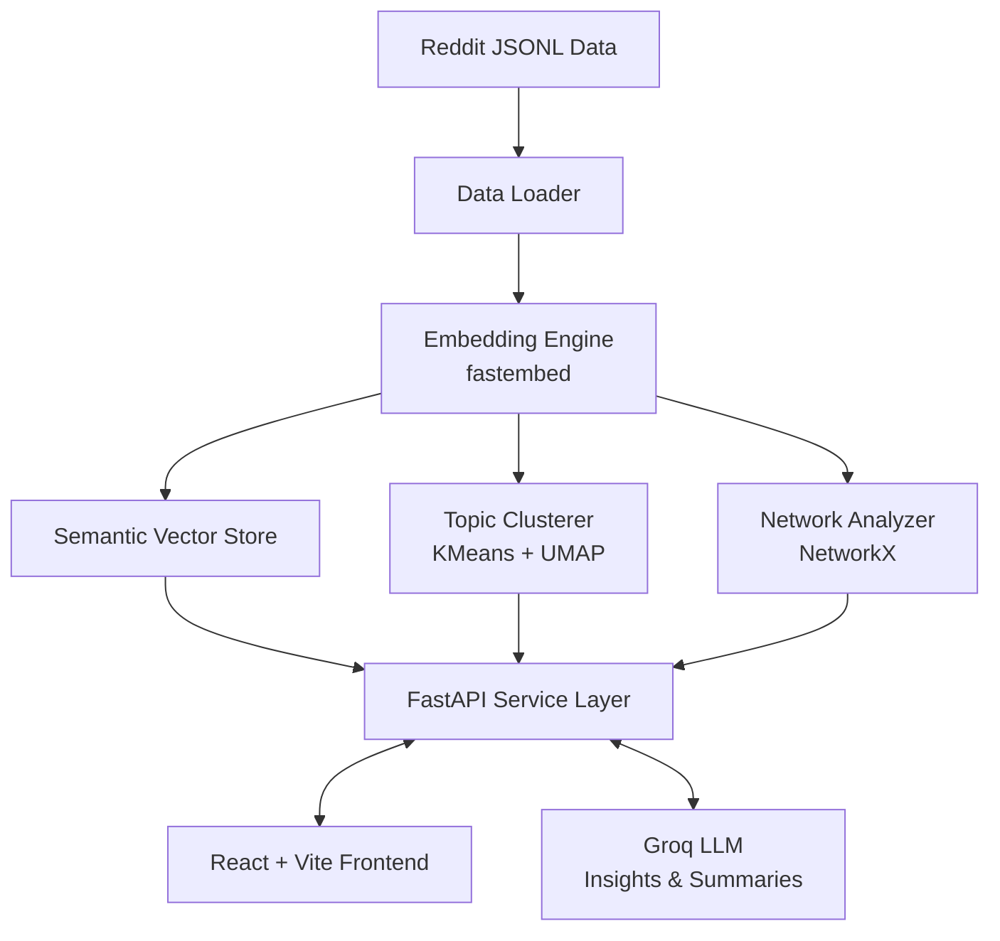

# SocialScape: Investigative Research Dashboard

<p align="center">
  <em>An interactive analysis platform mapping narrative spread, semantic clusters, and community influence across political networks.</em>
</p>

---

## Overview

<!-- PLACEHOLDER FOR SCREENSHOT: Overview Dashboard -->
<!-- Add your main dashboard screenshot showing the layout below -->

> *The central hub: Explore cross-ideological trends from a consolidated dataset.*

---

## Features

### 1. Semantic Search & Discovery
A highly relevant semantic query engine powered by dense vector embeddings. No exact keyword match required.

<!-- PLACEHOLDER FOR SCREENSHOT: Semantic Search Results showing the zero keyword overlap -->


**Zero Keyword Overlap Examples:**
- **Example 1**: Querying _"people helping each other without institutions"_ retrieves discussions on _mutual aid_. (Correct because it perfectly captures the definition conceptually).
- **Example 2**: Querying _"California attorney general record"_ matches a post about _Kamala Harris's prosecutor past_. (Correct because it correlates the public figure to the descriptive geographic role).
- **Example 3**: Querying _"capital punishment policy"_ matches debates on the _death penalty_. (Correct as it is structurally a semantic equivalent).

### 2. Narrative Time-Series Analysis
Track the rise and fall of topics over time. Every chart features a robust **GenAI Summary**, digesting complex trend metrics into plain-language insights dynamically generated via Groq LLM for non-technical audiences.

<!-- PLACEHOLDER FOR SCREENSHOT: Time Series Analysis Chart with the Groq Summary shown beneath it -->


### 3. Topic Clustering Space
Dynamically cluster discourse into visual semantic spaces. Powered by high-dimensional UMAP projection and K-Means clustering, completely tunable via a UI parameter.

<!-- PLACEHOLDER FOR SCREENSHOT: Topic Clustering / Nomic / UMAP Scatter Plot visually showing different colored clusters -->


### 4. Network & Influence Mapping
Visualizing community interaction using graph mapping. Computes metrics like **PageRank** and **Betweenness Centrality** to identify narrative linchpins. 

<!-- PLACEHOLDER FOR SCREENSHOT: Network / Graph Node Map showing connected accounts/topics -->


---

## AI / ML Specifications & Architecture

- **Embeddings**: `BAAI/bge-small-en-v1.5` via `fastembed` (384 dimensions, cosine similarity).
- **Dimensionality Reduction**: `UMAP` (umap-learn) — 5D for accurate clustering preprocessing, 2D for frontend visualization mapping.
- **Clustering Engine**: `KMeans` (scikit-learn) with a strictly bounded \( k \) spanning 2–50 clusters.
- **Network Centrality**: `PageRank` (\(\alpha = 0.85\)) via `NetworkX` to isolate super-spreaders.
- **Generative AI**: `llama-3.3-70b-versatile` via **Groq** for conversational analytics and time-series plain text summaries.



---

## Robustness & Edge Cases
- **Invalid Queries**: Zero-state returns helpful messages for empty search queries or those < 3 characters.
- **Graceful Nullity**: Empty datasets logically render safe components, clustering defaults to \( k=2 \) safely bounded up to \( k=50 \).
- **Network Resiliency**: Disconnected sub-graphs do not break traversal or PageRank evaluation computations.
- **API Limits**: The AI assistant gracefully throws explicit UI messages when rate limits/timeout bounds are reached.
- **Internationalization**: Non-English texts natively process through standard embedding vector spaces. 

---

## Local Setup Instructions

1. Ensure **Python 3.10+** and **Node 18+** are installed.
2. Install the backend stack:
   ```bash
   python -m pip install -r backend/requirements.txt
   ```
3. Boot up the user interface:
   ```bash
   cd frontend && npm install && npm run build
   ```
4. Launch the REST server locally:
   ```bash
   cd backend && uvicorn main:app --host 0.0.0.0 --port 8000
   ```
   *Dashboard live at `http://localhost:8000`*

*(Windows users: Utilize the provided `start.sh` via Git Bash, or run the `start.ps1` helper)*

---

## Demonstration & Walkthrough

<!-- PLACEHOLDER FOR YOUTUBE/GDRIVE VIDEO URL -->
**[Watch the specific platform design decision walkthrough here](insert_your_youtube_or_gdrive_url_here)** 

---

## Live Dashboard

<!-- PLACEHOLDER FOR LIVE HOSTING URL -->
**[Explore SocialScape Dynamically Hosted](insert_your_live_hosted_url_here)**
